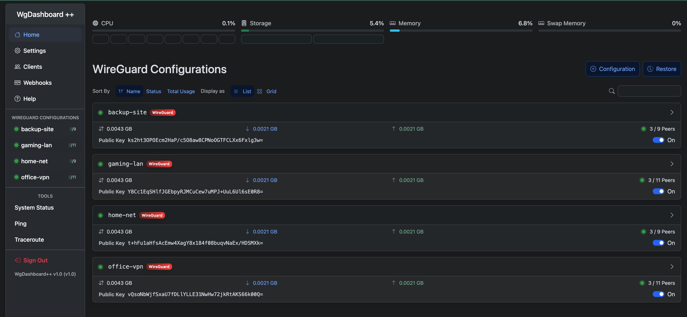
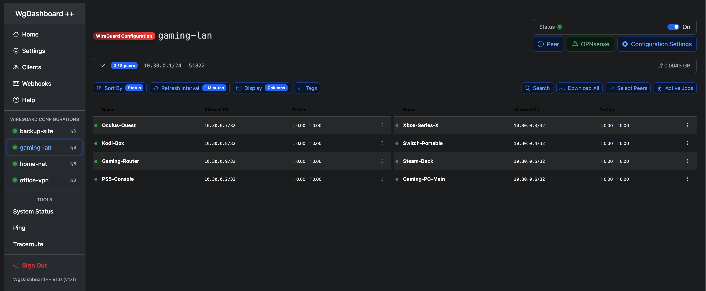
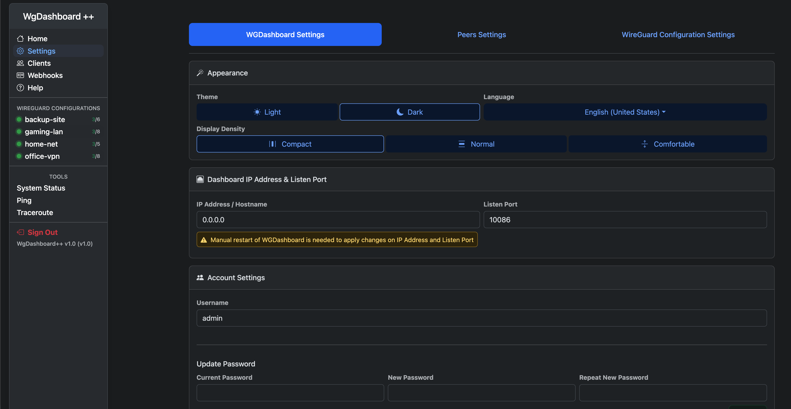
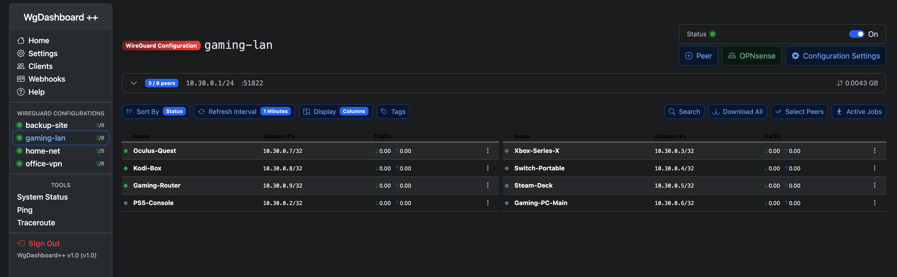

# WgDashboard++

<p align="center">
  
</p>

<p align="center">
    <a href="https://github.com/polumish/wgdashboard-plus-plus/releases/latest"></a>
    <a href="https://github.com/polumish/wgdashboard-plus-plus/blob/main/LICENSE"></a>
    <a href="https://github.com/polumish/wgdashboard-plus-plus/stargazers"></a>
    <a href="https://github.com/polumish/wgdashboard-plus-plus/issues"></a>
</p>

<p align="center">
    
    
    
    
    
</p>

<p align="center">
    <a href="https://github.com/polumish/wgdashboard-plus-plus/releases"></a>
    <a href="https://github.com/polumish/wgdashboard-plus-plus/discussions"></a>
    <a href="https://git.half.net.ua/polumish/wgdashboard-plus-plus/-/issues"></a>
</p>

## About

**WgDashboard++** is a fork of [WGDashboard](https://github.com/donaldzou/WGDashboard) v4.3.2 by **[Donald Zou](https://github.com/donaldzou)**, extended with backup & restore, MariaDB support, improved admin UX, and integration with OPNsense firewalls.

All credit for the base dashboard goes to the original author. This fork focuses on operational needs for managing multiple WireGuard networks with many peers and external clients.

> **v1.5+ requires MariaDB.** SQLite is no longer supported due to file-locking issues with concurrent operations. See [Migration Guide](docs/MIGRATION.md).

## Screenshots

### Overview
WireGuard configurations list on the home page.



### Dual-Column View
Total Commander-style split view — peer list divided into two side-by-side tables.



### Display Density
Gmail-style density settings — Compact / Normal / Comfortable.



### Compact Mode
Fit more peers on screen with tight spacing.



## Changes vs Upstream

### Backup & Restore (v1.4+)
- **Global scheduled snapshots** — daily/weekly/monthly with configurable retention (GFS rotation)
- **Per-config auto-backups** — automatic backup before any peer or config change
- **Granular restore** — select individual components (configs, settings, webhooks, clients, API keys)
- **Restore points** — automatic safety backup before every restore operation
- **Calendar & Table views** — visual backup history with color-coded dots and filters
- **Backup preview** — expandable tree showing configs, peer counts, dashboard components
- **Full database dump** — `mysqldump --single-transaction` for non-blocking backups
- **Progress bar** — real-time restore progress with stage descriptions

### Database (v1.5+)
- **MariaDB required** — eliminates SQLite file-locking issues that caused server freezes
- **Auto-migration** — `migrate_to_mariadb.sh` script for bare-metal, automatic in Docker
- **Docker Compose** — `docker/docker-compose.yml` with WGDashboard + MariaDB containers

### Client Features
- **Client portal** for self-service peer management (add/delete/restrict/allow/download)
- **Client config access management** — assign manager role per WG configuration
- **Trusted IPs** — skip TOTP for admin and client from allowed networks

### Admin Features
- **OPNsense Gateway integration** — manual setup panel matching OPNsense UI 1:1, auto port assignment, multi-network support
- **Gateways aggregation view** — all gateway peers across configurations in one page
- **Routed LAN Subnets** — server-side policy routing with one-click Apply
- **Broadcast AllowedIPs** — propagate a peer's allowed IPs to all other peers
- **Peer counts in sidebar** — connected/total counts next to each configuration
- **Configurable admin session timeout**

### Network Diagnostics (v1.5.2+)
- **Live diagnostic terminal** — neon-styled real-time view of WireGuard interface health
- **SSE-powered** — Server-Sent Events push updates instantly when state changes (no polling)
- **Per-interface diagnostics** — peers, endpoints, handshakes, transfer, system routes in one panel
- **Route validation** — cross-references AllowedIPs with kernel routing table, detects mismatches
- **Automatic warnings** — offline peers (handshake > threshold), missing routes, orphan routes, inactive peers with routes
- **Configurable threshold** — `peer_handshake_threshold` in `[Server]` section (seconds, default 300 = 5 min)
- **Settings tab** — unified view of all WG interfaces in Settings → Network Diagnostics
- **Collapsible panel redesign** — replaces old stat cards and charts with compact diagnostic terminal
- **Neon visual style** — dark semi-transparent background, color-coded status indicators with subtle glow, pulsing animations
- **REST API** — programmatic access for monitoring and alerting

#### Diagnostics API

| Endpoint | Description |
|----------|-------------|
| `GET /api/diagnostics` | Full snapshot of all interfaces (peers, routes, warnings) |
| `GET /api/diagnostics?interface=wg0` | Snapshot for a single interface |
| `GET /api/diagnostics/warnings` | All warnings across all interfaces with count |
| `GET /api/sse/diagnostics` | SSE stream — live updates pushed on state change |
| `GET /api/sse/diagnostics?interface=wg0` | SSE stream for a single interface |

All endpoints require authentication (session cookie or `wg-dashboard-apikey` header). SSE endpoints also accept `?apikey=` query parameter for cross-server access.

Example:
```bash
# Get all warnings
curl -H "wg-dashboard-apikey: YOUR_KEY" http://server:10086/api/diagnostics/warnings

# Full diagnostics for one interface
curl -H "wg-dashboard-apikey: YOUR_KEY" http://server:10086/api/diagnostics?interface=Full-Halfnet
```

Warning types:
| Type | Meaning |
|------|---------|
| `peer_offline` | Peer handshake older than threshold (default 5 min) |
| `peer_inactive` | Peer has never connected |
| `missing_route` | AllowedIPs entry exists but no kernel route found |
| `orphan_route` | Kernel route exists but no matching peer AllowedIPs |

### UI Improvements
- **Display density settings** — Compact / Normal / Comfortable (Gmail-style)
- **Dual-column Table view** — split peer list into two side-by-side tables (Total Commander style)
- **Zebra striping** — alternating row backgrounds on sidebar, config list, and peer tables
- **Collapsible configuration info panel** — slim info bar replaces large cards, diagnostic terminal below
- **Narrower adaptive sidebar** — width adapts to longest configuration name (180-260px)
- **Sorting** — sort peers by status, name, or traffic in table view

### Infrastructure
- **GitLab CI/CD** — automated testing and deployment on push to main
- **GitHub mirror** — automatic sync from GitLab
- **Docker** — published image on `ghcr.io/polumish/wgdashboard-plus-plus`
- **Cache-Control headers** on HTML responses

## Versioning

WgDashboard++ uses its own versioning independent of upstream:
- **X** — major (global behavior changes)
- **Y** — feature releases (+0.1)
- **Z** — bugfixes (+0.01)

Current: **v1.5.2**

## Feature Status

| Feature | Status |
|---------|--------|
| Backup & Restore (global + per-config) | Stable |
| MariaDB database | Stable (required since v1.5) |
| Client portal, trusted IPs, density, dual-column view | Stable |
| OPNsense Gateway integration | Stable |
| Gateways aggregation view | Stable |
| Routed LAN Subnets / policy routing | Stable |
| Network Diagnostics (live SSE terminal) | Stable |
| Docker deployment | Stable |

## Quick Start

### Bare-metal

```bash
# 1. Clone and install
git clone https://github.com/polumish/wgdashboard-plus-plus.git /opt/WGDashboard
cd /opt/WGDashboard/src
chmod +x wgd.sh
./wgd.sh install

# 2. Migrate to MariaDB (required for v1.5+)
sudo ./migrate_to_mariadb.sh --db-password YourStrongPassword

# 3. Start
./wgd.sh start
```

### Docker

```bash
cd docker
# Edit docker-compose.yml — change passwords!
docker compose up -d
```

See [`docker/docker-compose.yml`](docker/docker-compose.yml) for configuration options.

## Migration from SQLite

If upgrading from v1.4 or earlier, see the [Migration Guide](docs/MIGRATION.md) for step-by-step instructions.

## Deployment

See [`DEPLOYMENT.md`](DEPLOYMENT.md) for systemd service, nginx reverse proxy, and CI/CD auto-deploy setup.

## License

Apache License 2.0, same as upstream WGDashboard.

## Upstream Documentation

For installation, API reference, and base feature documentation, see the original WGDashboard README preserved as [`README_UPSTREAM.md`](README_UPSTREAM.md).

---

**Original WGDashboard:** https://github.com/donaldzou/WGDashboard
**Original Author:** [Donald Zou](https://github.com/donaldzou)
**This Fork:** https://github.com/polumish/wgdashboard-plus-plus
**Forked by:** [polumish](https://github.com/polumish)
